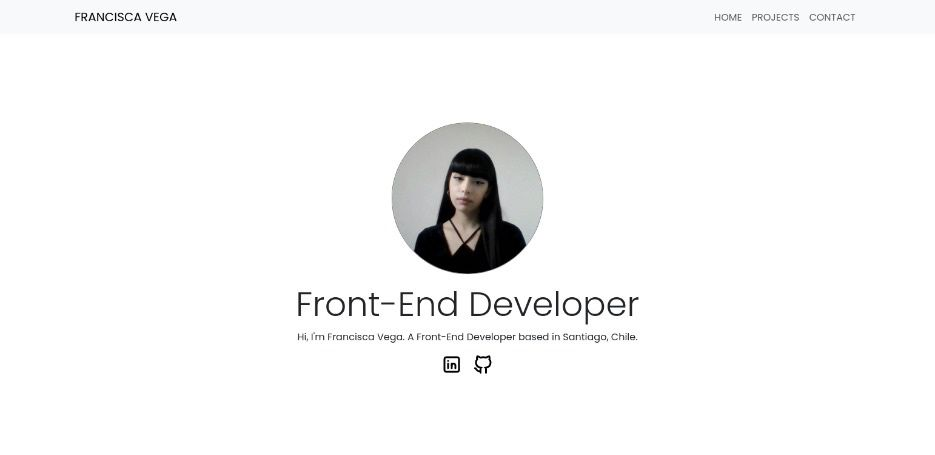

# Portfolio

## Table of Contents

- [Introduction](#introduction)
- [Technologies Used](#technologies-used)
- [Features](#features)
- [Contact](#contact)

## Introduction

This is where I showcase my projects, skills, and contact information. Whether you're interested in my work, want to collaborate, or simply want to reach out, you'll find everything you need right here.

## Technologies Used

- ReactJS
- Bootstrap
- React Hook Form
- React Toastify
- Tabler Icons
- Firestore
- Jest
- Figma

## Features

- **Project Showcase**: View my projects and their details.
- **Contact Form**: Get in touch with me via the contact form.

## Contact

I'm just an email away! Feel free to reach out to me via the following methods:

  
  
  

